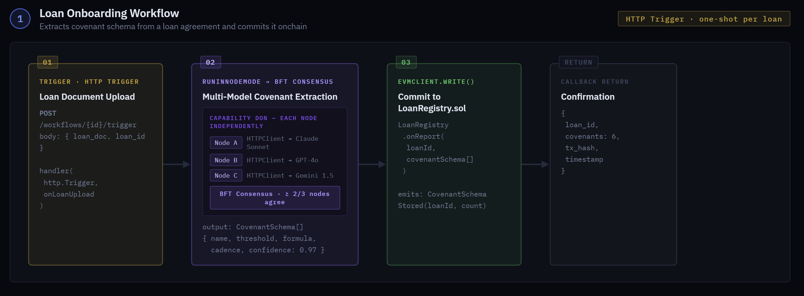
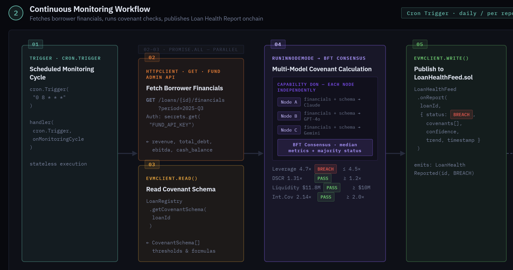

# Covenant-Sentinel
AI-Powered Loan Health Oracle for Tokenized Private Credit, built using Chainlink CRE and ACE

## Overview
Covenant Sentinel is an automated system that extracts covenant rules from loan documents using AI, continuously checks borrower financials against those rules, and publishes a verified health status on-chain, where any protocol or investor can consume it in real time. When a 
covenant breach is detected, Chainlink ACE automatically blocks transfers of the associated token, enforcing the breach at the infrastructure level without any manual intervention. Covenant Sentinel is built using the Chainlink Runtime Environment (CRE) and Chainlink ACE (Automated Compliance Engine). The system has two CRE workflows and a set of smart contracts.

## How It Works 

#### Step 1: Loan Onboarding 
A loan agreement is uploaded to the system. AI models (Claude, GPT-4o, Gemini) independently extract the covenant structure: what metrics matter, what the thresholds are, how key financial measures like EBITDA are defined (including any custom adjustments), and what the reporting schedule is. The Chainlink node network reaches consensus on the extracted terms, and the verified covenant schema is stored onchain. 

#### Step 2: Continuous Monitoring 
On a recurring schedule (daily for the POC; matched to the actual reporting cadence in production), the system fetches the borrower’s latest financials from the fund administrator’s reporting portal. It retrieves the stored covenant schema from the blockchain, calculates each 
metric, and compares it against the thresholds. Multiple AI models run the calculations independently, and the result is published only when a majority agree. 

#### Step 3: Health Report Publication 
The system publishes a Loan Health Report to the LoanHealthFeed smart contract. For each covenant, the report includes: 
• Status: PASS, WARNING, or BREACH 
• Calculated metric value (e.g., leverage ratio = 4.7x) 
• Confidence score from multi-model consensus 
• Trend indicator: improving, stable, or deteriorating 
This is where the CRE workflow ends. It does not interact with ACE directly. The health report is simply written to the LoanHealthFeed contract and made available for any consumer to read. 

#### Step 4: Automatic Transfer Enforcement via ACE 
Enforcement happens at transfer time, not at report publication time. The token contract (ComplianceGatedERC20) inherits Chainlink’s PolicyProtected mixin. Every time someone calls transfer(), the runPolicy modifier intercepts the call and routes it through the PolicyEngine. 
The PolicyEngine runs the registered LoanHealthPolicy, which reads the latest health report from LoanHealthFeed. If the loan is in BREACH, the transfer reverts. If the status is PASS or WARNING, the transfer proceeds normally. 

#### Workflow 1

  

#### Workflow 2

  

 

### Contract deployments

**Ethereum Sepolia Testnet**

| Contract | Address  |
| :----- | :- |
| LoanRegistry | [`0xFDF832e99b716D63068a58C37aBb83006Eb6C902`](https://sepolia.etherscan.io/address/0xFDF832e99b716D63068a58C37aBb83006Eb6C902)|
| LoanHealthFeed | [`0xeC15EC785A6b234584bD7206843ED0F64a47cF2B`](https://sepolia.etherscan.io/address/0xeC15EC785A6b234584bD7206843ED0F64a47cF2B)|
| ComplianceGatedERC20  | [`0x5a470ED00ED1aD1CFE7db87ee3e85399e3538140`](https://sepolia.etherscan.io/address/0x5a470ED00ED1aD1CFE7db87ee3e85399e3538140) |
| LoanHealthPolicy | [`0xBbDB5Fba16e0aC540699B22Bbf975EaCAbc97342`](https://sepolia.etherscan.io/address/0xBbDB5Fba16e0aC540699B22Bbf975EaCAbc97342)|
| PolicyEngine | [`0x6e7986eFb9B2d366FDD0b0dEbF29457c4658b785`](https://sepolia.etherscan.io/address/0x6e7986eFb9B2d366FDD0b0dEbF29457c4658b785)|

 

### Chainlink Usage

#### CRE
[Loan onboarding workflow](cre-workflows/loan-onboarding/main.ts) 
 
[Continuous monitoring workflow](cre-workflows/monitoring/main.ts)

#### ACE
[LoanHealthPolicy contract](contracts/src/policies/LoanHealthPolicy.sol)
 
[ComplianceGatedERC20 contract](contracts/src/ComplianceGatedERC20.sol)
